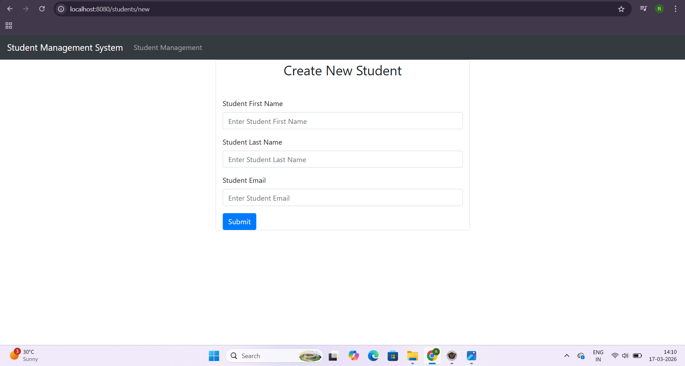
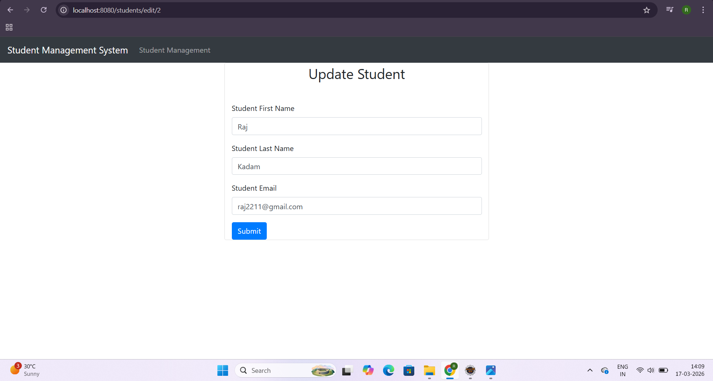
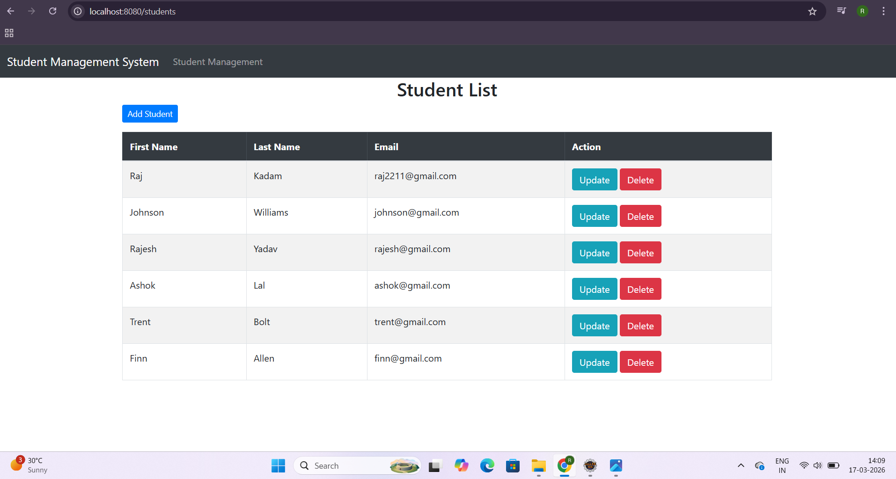

# 🎓 Student Management System

A full-stack web application built using Spring Boot, Hibernate, Thymeleaf, and MySQL to manage student records efficiently. This project follows the MVC (Model-View-Controller) architecture.

---

## Features

* Add new student
* View all students
* Update student details
* Delete student records
* Form handling with validation

---

## Tech Stack

* Java
* Spring Boot
* Hibernate (JPA)
* Thymeleaf
* MySQL

---

## 📸 Screenshots

### Add Student Page

### Update Student Page

### Student List Page

---

##  Run Locally

1. Clone the repository
   git clone https://github.com/RaghuChauhan1999/student-management-system.git

2. Open in IDE

3. Configure MySQL in application.properties

4. Run the project

5. Open in browser
   http://localhost:8080/students

---

##  Project Overview

This project demonstrates my understanding of backend development using Spring Boot and MVC architecture. It handles real-world operations like managing student data with database integration.

---

##  Author

Raghu Chauhan
